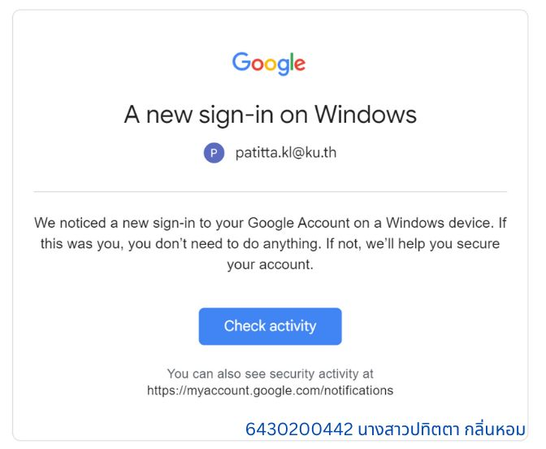
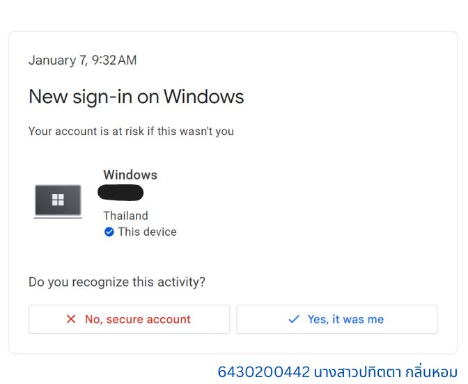

# Security Control

## Google Security Alert
- หรือเรียกอีกอย่างว่า Sign-in Notification เป็นการแจ้งเตือนด้านความปลอดภัยเมื่อมีการเข้าสู่ระบบจากอุปกรณ์ใหม่ของ google เพื่อให้ผู้ใช้ตรวจสอบว่าการเข้าถึงบัญชีนั้นเป็นของตนเองหรือไม่

## Location
- Home , My account

## เป็น Control Function ประเภทไหน ?
- ประเภท Detective Control

## ทำไมถึงเป็น Detective Control ?
- เพราะช่วยตรวจจับและเป็นการแจ้งเตือนการลงชื่อเข้าใช้งานที่ช่วยให้เจ้าของบัญชีสามารถตรวจจับกิจกรรมที่อาจเป็นภัยคุกคาม
- ช่วยให้เจ้าของบัญชีรับรู้กิจกรรมที่อาจไม่ปลอดภัย และดำเนินการรักษาความปลอดภัยเพิ่มเติมได้ เช่น ตรวจสอบกิจกรรม หรือเปลี่ยนรหัสผ่าน
- ไม่ได้ป้องกันการเข้าสู่ระบบโดยตรง แต่ช่วยให้ผู้ใช้สามารถตรวจสอบและดำเนินการแก้ไขด้วยตนเอง หากพบว่ามีการเข้าถึงที่ไม่ได้รับอนุญาต

## เป็น Type of Security Control ประเภทไหน ?
- ประเภท Technical Control

## ทำไมถึงเป็น Technical Control ?
- เพราะใช้เทคโนโลยีของ Google ในการตรวจสอบความปลอดภัย โดยตรวจจับและแจ้งเตือนผู้ใช้เกี่ยวกับการเข้าสู่ระบบจากอุปกรณ์ใหม่ 
- เป็นระบบอัตโนมัติที่ช่วยตรวจสอบความปลอดภัยของบัญชีผ่านกลไกดิจิทัล ซึ่งเป็นการควบคุมทางเทคนิคที่ช่วยเพิ่มความปลอดภัยของบัญชี

## My Summary
- Google Security Alert หรือ Sign-in Notification เป็นการแจ้งเตือนด้านความปลอดภัยเมื่อมีการลงชื่อเข้าใช้บัญชีจากอุปกรณ์ใหม่ เพื่อให้เจ้าของบัญชีตรวจสอบว่าเป็นการเข้าถึงที่ถูกต้องหรือไม่ หากไม่ใช่ สามารถดำเนินการป้องกันเพิ่มเติม เช่น เปลี่ยนรหัสผ่าน ซึ่งจัดเป็น Detective Control เพราะช่วยตรวจจับและแจ้งเตือนภัยคุกคาม และเป็น Technical Control เพราะใช้เทคโนโลยีของ Google ตรวจสอบและเสริมความปลอดภัยของบัญชีโดยอัตโนมัติได้อย่างมีประสิทธิภาพ

## Made by
- ชื่อ นางสาวปทิตตา กลิ่นหอม ชื่อเล่น พลอย รหัสนิสิต 6430200442
